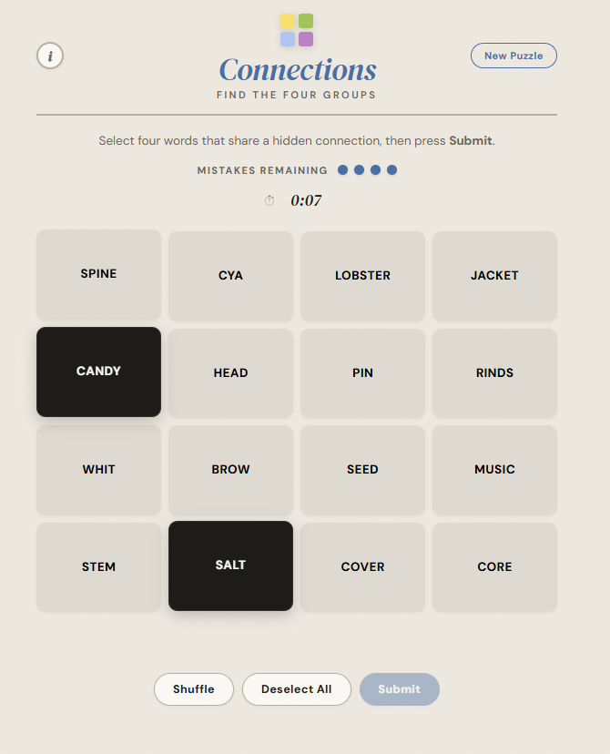
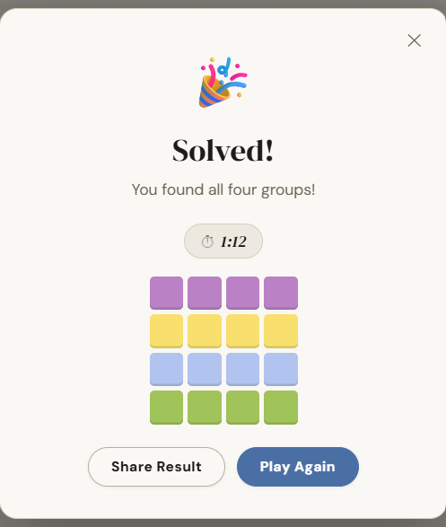
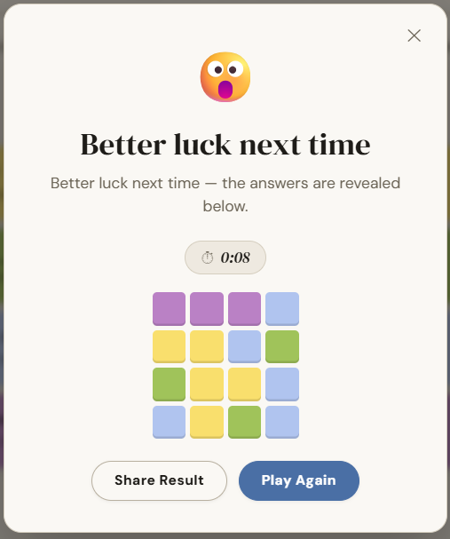

# NYT Connections Puzzle Generator

> An end-to-end ML/NLP system that learns the structural patterns of the New York Times *Connections* puzzle and generates original, fully playable puzzles — served through a REST API and a polished static web frontend.

The project ingests the complete historical archive of NYT Connections puzzles, mines their linguistic patterns using sentence embeddings and a trained difficulty classifier, and generates novel puzzles that replicate the game's signature mechanics: four color-coded difficulty tiers, compound-word fill-in-the-blank groups, homophone and wordplay categories, semantic red herrings, and strict cross-puzzle deduplication. A FastAPI backend handles generation, storage, and guess validation. A self-contained HTML/CSS/JS frontend delivers the full NYT gameplay experience including sound effects, animations, a live timer, share-result emoji grid, and a How to Play modal.

### Web Link: https://nyt-connections-puzzle-generator.onrender.com

---

## Table of Contents

- [How to Play](#how-to-play)
- [Screenshots](#screenshots)
- [How It Works — System Overview](#how-it-works--system-overview)
  - [Phase 2 — Pattern Analyzer](#phase-2--pattern-analyzer)
  - [Phase 3 — Embeddings](#phase-3--embeddings)
  - [Phase 4 — Difficulty Classifier](#phase-4--difficulty-classifier)
  - [Phase 5 — Group Generator](#phase-5--group-generator--puzzle-assembler)
  - [Phase 6 — Validator](#phase-6--validator)
  - [Phase 7 — REST API](#phase-7--rest-api)
  - [Phase 8 — Static Frontend](#phase-8--static-frontend)
- [Theme Types](#theme-types)
- [Tech Stack](#tech-stack)
- [Prerequisites](#prerequisites)
- [Installation](#installation)
- [Running the ML Pipeline](#running-the-ml-pipeline)
- [Running the API](#running-the-api)
- [Running the Frontend](#running-the-frontend)
- [API Reference](#api-reference)

---

---

## How to Play

**Objective:** Find four groups of four words that share a hidden connection.

**Difficulty tiers:**

| Color | Difficulty | Description |
|---|---|---|
| 🟨 Yellow | Easiest | A clear, direct connection |
| 🟩 Green | Moderate | Requires lateral thinking |
| 🟦 Blue | Tricky | Subtle connection; watch for red herrings |
| 🟪 Purple | Hardest | Wordplay, homophones, or unexpected links |

**How to play:**
1. Click four tiles you think share a connection.
2. Press **Submit** to check your guess.
3. If correct, the group is revealed with its color and theme label.
4. If incorrect, you lose one life. You have **four lives** total.
5. If the game tells you **"One away…"** — three of your four selected words are correct.
6. Submitting the same combination twice shows an **"Already guessed!"** toast with no life penalty.
7. Use **Shuffle** to reorder the tiles if you're stuck.
8. The timer starts on your first tile click and stops when the puzzle ends.

**Sharing your result:**
After the puzzle ends, click **Share Result** to copy your emoji grid to the clipboard. Each square shows the actual color of the group that word belongs to — so a wrong guess row might show 🟨🟨🟩🟦 rather than all grey.

**Controls:**

| Button | Action |
|---|---|
| Submit | Check your current 4-tile selection |
| Shuffle | Randomly reorder all remaining tiles |
| Deselect All | Clear your current selection |
| New Puzzle | Load a fresh puzzle (never repeats a seen puzzle) |
| ⓘ | Open the How to Play guide |

---

## Screenshots

### Main Game Board



*The main game board — 16 tiles arranged in a 4×4 grid, with the lives indicator, Shuffle, Deselect All, and Submit controls.*

---

### Win Screen



*The win modal showing the final puzzle time and the per-word colour-coded emoji share grid.*

---

### Loss Screen



*On loss, all four groups are revealed and the guess history is displayed in the modal.*


---

## How It Works — System Overview

The system is structured as a sequential ML pipeline. Each phase produces artifacts consumed by the next. Phases 2–4 are training phases (run once). Phases 5–6 run every time a new puzzle is requested.

### Phase 2 — Pattern Analyzer

`ml/pattern_analyzer.py` reads `data/connections.json` and extracts the structural DNA of NYT puzzles:

- **Theme type classification** — Every historical group is classified into one of 12 theme types (fill-in-blank suffix, fill-in-blank prefix, category, descriptor, double-meaning, homophone, plus/minus letters, rhyme, person name, brand, hidden word, initialism) using a hierarchy of regular expressions.
- **Compound root extraction** — Fill-in-blank groups (e.g. `PAPER ___`) are decomposed into their root word and the set of valid completions. These form the template library for generation.
- **Red herring candidates** — Words that appear in multiple different group themes across the archive are flagged as natural red herrings — semantically ambiguous words that mislead solvers.
- **Domain tagging** — Every group is tagged with a content domain (sports, geography, food, music, film/TV, science, etc.) to enable cross-domain diversity enforcement at generation time.
- **Vocabulary universe** — Every word that has ever appeared in any puzzle is extracted into a validated vocabulary set. Only words in this set can be used as puzzle answers.

Output: `ml/models/pattern_clusters.json`

---

### Phase 3 — Embeddings

`ml/embeddings.py` uses `sentence-transformers` (`all-MiniLM-L6-v2`) to encode every unique member word and every theme label into a 384-dimensional semantic vector space. All vectors are L2-normalised so cosine similarity equals the dot product.

Key design decisions:
- **Separate word and theme matrices** — Word vectors and theme vectors are stored separately so nearest-neighbor queries can run efficiently with a single matrix multiply.
- **Batch encoding** — All words are encoded in configurable batches with `show_progress_bar=True`.
- **Sanity checks** — After encoding, the script verifies that semantically related words (e.g. GRADE and EVALUATE) have high cosine similarity, and that known red herring words score highly against multiple themes.

These embeddings power four downstream operations: group coherence scoring, cross-group semantic contamination (red herring detection), the difficulty classifier feature vector, and mutation candidate selection.

Output: `ml/models/embeddings_cache.npz`, `ml/models/embeddings_index.json`

---

### Phase 4 — Difficulty Classifier

`ml/difficulty_model.py` trains a `GradientBoostingClassifier` wrapped in a `StandardScaler` pipeline to predict which difficulty tier (Yellow=0, Green=1, Blue=2, Purple=3) a group belongs to.

**Feature vector (24 dimensions):**
| Feature | Description |
|---|---|
| `group_coherence` | Average pairwise cosine similarity of the 4 members |
| `theme_member_sim_mean` | Average cosine sim of members to their theme label vector |
| `theme_member_sim_std` | Spread of member-theme similarities (ambiguity signal) |
| `theme_member_sim_min` | Weakest-fitting member (outlier detection) |
| `avg_member_word_length` | Surface feature |
| `label_word_count` | Surface feature |
| `red_herring_count` | How many members appear in 2+ different historical themes |
| `theme_type_one_hot` | 17-dimensional type encoding |

Training uses 5-fold stratified cross-validation. The trained pipeline is serialised with `pickle` and loaded lazily on first use.

The assembler uses this classifier to solve the assignment problem: given 4 candidate groups, find the permutation that assigns each group to a distinct difficulty level with maximum total probability. This is done by exhaustive enumeration of all 24 permutations.

Output: `ml/models/difficulty_classifier.pkl`, `ml/models/difficulty_report.json`

---

### Phase 5 — Group Generator & Puzzle Assembler

This is the creative core. Generation has two sub-phases.

#### 5a — Group Generator (`ml/group_generator.py`)

Generates a pool of 32 candidate `CandidateGroup` objects using 12 distinct strategies:

**Strategy dispatch:**
```
fill_suffix  (18%)  → WORD ___   compound completions
fill_prefix  (13%)  → ___ WORD   compound completions
category     (22%)  → named real-world set membership
descriptor   (15%)  → "Things that ___" / "Ways to ___"
double_meaning (7%) → word used in two distinct domains
homophone    (6%)   → sounds like another word
plus_minus   (5%)   → add/remove a letter to form a new word
rhyme        (4%)   → all four rhyme with a target word
person_name  (4%)   → also a common first or last name
brand        (3%)   → brand, company, franchise
hidden_word  (2%)   → contains a hidden word
initialism   (1%)   → abbreviation or acronym
```

**Quality gates applied to every candidate group:**
1. All 4 members must be in the validated historical vocabulary
2. No word may appear in the hard blocklist (known non-words and known bad outputs)
3. No two members may be morphological variants of each other (FROST/FROSTED blocked)
4. No significant word from the theme label may appear as a member
5. For non-structural types: every member must have cosine similarity ≥ 0.09 to the centroid of the other three (semantic coherence check — blocks EVE appearing in an ANT-compound group)
6. Group pairwise coherence must fall in [0.17, 0.93]
7. Must not be an exact-match replay of any historical group
8. Must not be session-deduped (see deduplication below)

**Structural vs. semantic types:**
Structural types (homophone, rhyme, plus/minus, hidden word, initialism, double meaning) are used verbatim from the historical archive with no mutation. Semantic types (category, descriptor, person name) always have exactly one member mutated by nearest-neighbor substitution in embedding space to ensure novelty while preserving the group's semantic character.

**Fill-in-blank word forms:**
Fill-in-blank completions are taken from the compound root table without any normalisation — preserving forms like PAGES (YELLOW PAGES), BLUES (feeling ___), etc.

**Smart singular/plural normalisation:**
A `needs_plural()` function detects when a theme label implies plural members (e.g. labels containing MEMBERS, TEAMS, FANS, PLAYERS) and attempts to pluralise accordingly. A `_FORCE_PLURAL` set of 60+ words (PANTS, SCISSORS, GLASSES, SAVINGS, etc.) are never de-pluralised regardless of context.

#### 5b — Puzzle Assembler (`ml/puzzle_assembler.py`)

Selects the best 4-group combination from the pool by evaluating up to 600 combinations against a weighted scoring function:

| Signal | Weight | Description |
|---|---|---|
| `difficulty_spread` | 4.0 | All 4 difficulty levels covered |
| `type_diversity` | 3.0 | Reward for more distinct theme types |
| `red_herring_bonus` | 2.0 | Bonus per confirmed red herring word |
| `contamination` | 1.5 | Cross-group semantic overlap (makes puzzle tricky) |
| `coherence_gradient` | 1.0 | Yellow most coherent, Purple least |

**Diversity enforcement (hard constraints):**
- ≥ 3 distinct effective theme type families per puzzle
- ≤ 2 groups of the same effective type per puzzle
- Fill-suffix and fill-prefix count as one type family
- ≤ 1 group per content domain per puzzle (prevents sports flooding)

**Deduplication (cross-session persistent):**
`_SessionStore` tracks every used theme label (canonicalised — punctuation stripped, whitespace collapsed, all uppercase) and every used member-set frozenset. This is persisted to `ml/models/session_used.json` so dedup survives API restarts. "NHL TEAM MEMBER" and "N.H.L. TEAM MEMBER" are treated as the same theme. Once a theme is used, it never appears again.

---

### Phase 6 — Validator

`ml/validator.py` is the quality gate. Every generated puzzle must pass 10 checks before being stored:

| Check | Type |
|---|---|
| Exactly 4 groups of 4 members | Hard failure |
| All 16 words are unique | Hard failure |
| One group at each level (0–3) | Hard failure |
| No single-word theme appears verbatim as a member | Hard failure |
| No morphological variants within any group | Hard failure |
| No exact duplicate of any historical group | Hard failure |
| Theme labels are sufficiently distinct from each other | Hard failure |
| Theme type diversity (≥3 types, ≤2 of any one type) | Hard failure |
| Domain diversity (≤1 per domain) | Hard failure |
| Group coherence ≥ 0.20 | Hard failure |
| Coherence gradient (Yellow ≥ Green ≥ Blue ≥ Purple) | Soft warning |
| Red herring presence | Soft warning |

A `quality_score` (0.0–1.0) is computed from coherence spread, red herring count, and theme type diversity. Only puzzles that pass all hard checks are written to the puzzle store.

---

### Phase 7 — REST API

`api/main.py` is a FastAPI application. All routes are prefixed with `/api`.

**Startup:** On launch the puzzle store is pre-warmed from `api/puzzle_store.json`. The `ml/` directory is injected onto `sys.path` so the generator modules resolve regardless of working directory.

**CORS:** Configured to allow `localhost:3000`, `localhost:5173`, `localhost:8080`, and `null` (file:// origin) during development.

**Thread safety:** `PuzzleStore` uses a class-level `threading.Lock` and an in-memory dict index for O(1) lookup by puzzle ID.

---

### Phase 8 — Static Frontend

`site/index.html` is a fully self-contained single-file application (no bundler, no framework, no module imports) that works by double-clicking or from any static server.

**Game features:**
- 4×4 tile grid with staggered entrance animation
- Tile selection (up to 4), bounce animation on select
- Already-guessed detection — same combination cannot be submitted twice
- Shake animation on wrong guess
- Flip animation on correct guess
- One-away toast notification
- 4-dot lives indicator with spring animation on loss
- Color-coded solved group bars with reveal animation
- Live countdown timer (starts on first tile click, stops on win/loss)
- Shuffle and Deselect All controls
- Win/loss modal with emoji share grid (per-word group colours, not per-guess)
- Copy-to-clipboard share text with timer included
- Close modal → floating "View Results" pill button to reopen
- How to Play modal with example board
- Web Audio API sound effects (select, deselect, correct, wrong, one-away, win, lose, already-guessed)
- Warm parchment colour scheme with noise texture background
- DM Serif Display + DM Sans typography
- API-first with offline fallback puzzle

---

## Theme Types

| Type | Example Theme | Example Members |
|---|---|---|
| `fill_suffix` | `PAPER ___` | CLIP, TRAIL, TOWEL, TIGER |
| `fill_prefix` | `___ BALL` | BASE, BASKET, FOOT, SNOW |
| `category` | `CURRENCIES` | PESO, FRANC, KRONA, DINAR |
| `descriptor` | `THINGS THAT CAN RUN, ANNOYINGLY` | DYE, MASCARA, NOSE, STOCKINGS |
| `double_meaning` | `MUSIC TERMS ALSO USED IN BASEBALL` | PITCH, SLIDE, REST, BUNT |
| `homophone` | `HOMOPHONES OF NUMBERS` | ATE, FOR, WON, TOO |
| `plus_minus` | `ADD A LETTER TO MAKE AN ANIMAL` | BARE, HOSE, LOIN, MUSE |
| `rhyme` | `RHYMES WITH "LIGHT"` | NIGHT, RIGHT, BITE, KITE |
| `person_name` | `ALSO A FIRST NAME` | GRACE, FAITH, JOY, HOPE |
| `brand` | `ADVERTISING SLOGANS` | SWOOSH, ARCH, TICK, STAR |
| `hidden_word` | `EACH CONTAINS A BODY PART` | ISLAND, EARNEST, LOPING, SHEEP |
| `initialism` | `NATO PHONETIC ALPHABET` | ALPHA, BRAVO, CHARLIE, DELTA |

---

## Tech Stack

| Layer | Technology |
|---|---|
| Embeddings | `sentence-transformers` (`all-MiniLM-L6-v2`) |
| Difficulty classifier | `scikit-learn` `GradientBoostingClassifier` |
| Numerical compute | `numpy` |
| API framework | `FastAPI` + `uvicorn` |
| API validation | `Pydantic v2` |
| Frontend | Vanilla HTML/CSS/JS (no framework) |
| Fonts | Google Fonts (DM Serif Display, DM Sans) |
| Audio | Web Audio API (no external files) |
| Python version | 3.11+ |

---

## Prerequisites

- Python **3.11** or higher
- `pip`
- `data/connections.json` — the historical puzzle archive (not included in this repository; place it at `data/connections.json` before running the pipeline)

---

## Installation

```bash
# 1. Clone the repository
git clone https://github.com/your-username/connections-generator.git
cd connections-generator

# 2. Create and activate a virtual environment
python -m venv .venv
source .venv/bin/activate        # macOS / Linux
.venv\Scripts\activate           # Windows

# 3. Install dependencies
pip install -r requirements.txt

# 4. Place your connections.json in the data directory
mkdir -p data
cp /path/to/your/connections.json data/connections.json
```

---

## Running the ML Pipeline

The pipeline must be run once before the API can generate puzzles. It trains all models and caches the embeddings.

```bash
# Full pipeline (first-time setup — takes 10–20 minutes)
python run_pipeline.py

# Skip Phase 3 if embeddings are already cached (saves ~10 minutes)
python run_pipeline.py --skip-embeddings

# Skip Phases 2–4 entirely if all model files exist
python run_pipeline.py --skip-training

# Only run the generator + validator (test a puzzle without retraining)
python run_pipeline.py --generate-only

# Only run Phases 2–4, skip generation test
python run_pipeline.py --no-generate
```

After a successful run, the `ml/models/` directory will contain:

```
ml/models/
├── pattern_clusters.json      (~2–5 MB depending on archive size)
├── embeddings_cache.npz       (~50–150 MB)
├── embeddings_index.json
├── difficulty_classifier.pkl
├── difficulty_report.json
└── session_used.json          (created on first puzzle generation)
```

The pipeline also writes a validated test puzzle to `api/puzzle_store.json`.

---

## Running the API

```bash
# Development (auto-reload on file changes)
uvicorn api.main:app --reload --port 8000

# Production
uvicorn api.main:app --host 0.0.0.0 --port 8000 --workers 1
```

> **Note:** Use `--workers 1` in production. The puzzle generator loads large numpy arrays and a scikit-learn model into memory; multiple workers will each load their own copy and may exhaust RAM.

Interactive API documentation is available at:
- Swagger UI: `http://localhost:8000/docs`
- ReDoc: `http://localhost:8000/redoc`

---

## Running the Frontend

The frontend is a single HTML file with no build step required.

**Option A — Direct file open (simplest):**
```bash
open site/index.html          # macOS
start site/index.html         # Windows
xdg-open site/index.html      # Linux
```

**Option B — Local static server (recommended for API integration):**
```bash
# Python built-in server
cd site && python -m http.server 5173

# Or with Node
npx serve site
```

Then open `http://localhost:5173` in your browser.

> The site will work offline using a hardcoded fallback puzzle. To play generated puzzles, the API must be running at `http://localhost:8000`.

---

## API Reference

### `POST /api/generate`
Generate a new puzzle. Retries up to 5 times internally to ensure the result passes validation.

**Request body (all optional):**
```json
{
  "seed": 42,
  "pool_size": 24
}
```

**Response:**
```json
{
  "puzzle": {
    "id": "gen-3f8a1b2c",
    "groups": [
      {
        "level": 0,
        "color": "yellow",
        "hex": "#F9DF6D",
        "theme": "PAPER ___",
        "members": ["CLIP", "TRAIL", "TOWEL", "TIGER"],
        "theme_type": "fill_suffix",
        "coherence": 0.5523
      }
    ],
    "words_shuffled": ["CLIP", "BLUSH", ...],
    "red_herrings": ["SCORE", "PACE"]
  },
  "validation_passed": true,
  "quality_score": 0.812,
  "warnings": []
}
```

---

### `GET /api/puzzle/random`
Return a randomly selected stored puzzle.

---

### `GET /api/puzzle/{id}`
Return a specific puzzle by ID.

---

### `GET /api/puzzles`
Return a lightweight list of all stored puzzles (ID + theme labels only).

---

### `POST /api/puzzle/{id}/guess`
Validate a player's 4-word guess.

**Request body:**
```json
{
  "puzzle_id": "gen-3f8a1b2c",
  "words": ["CLIP", "TRAIL", "TOWEL", "TIGER"]
}
```

**Response:**
```json
{
  "correct": true,
  "one_away": false,
  "group": { "level": 0, "color": "yellow", "theme": "PAPER ___", ... },
  "message": "Correct! The YELLOW group was: PAPER ___"
}
```

---

### `GET /health`
```json
{ "status": "ok", "puzzles_stored": 14 }
```
